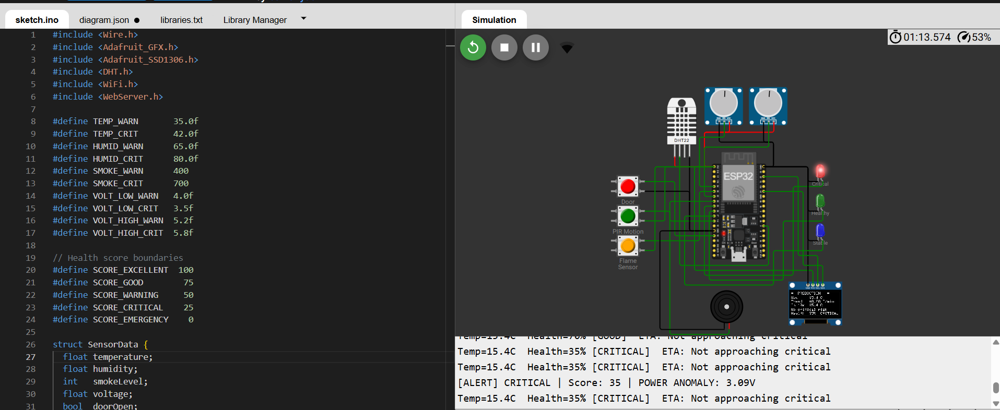
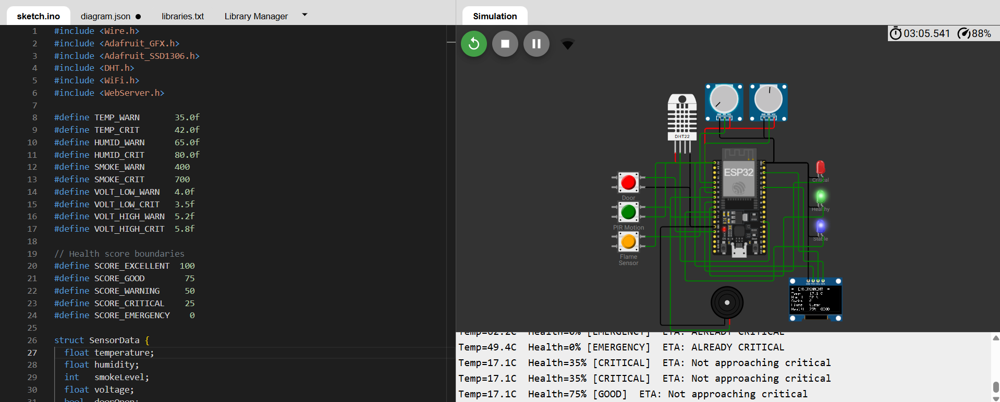
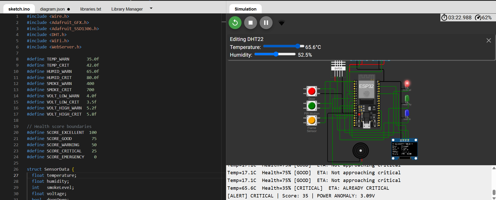
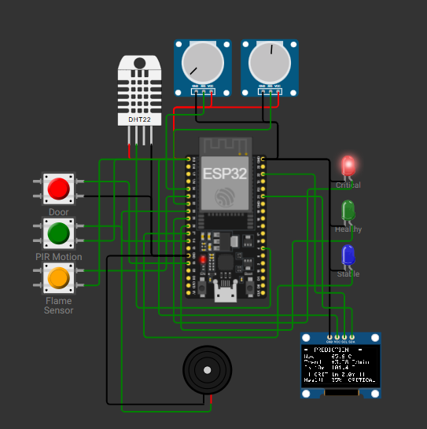
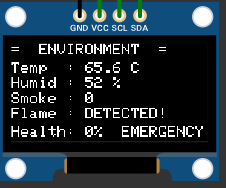
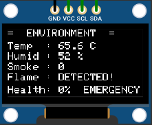
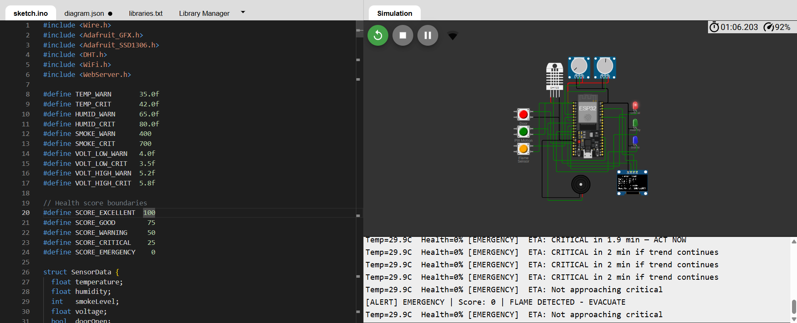

# ⚡ ServerSense Pro
### Intelligent Server Room Guardian — ESP32 + IoT + Predictive Risk Engine

A real-time embedded monitoring system that watches a server room's environment, security, and power health — then predicts how many minutes remain before conditions turn critical, instead of just reacting after the fact.

---

## 🎯 Problem Statement

Server rooms fail silently — overheating, humidity damage, unauthorized access, and power instability often go unnoticed until hardware is already damaged. Commercial monitoring systems are expensive and purely reactive.

**ServerSense Pro** is an open-source ESP32-based system that continuously scores room health (0–100%) and predicts time-to-critical for rising temperature trends — all simulatable in Wokwi with no physical hardware required.

---

## ✨ Key Feature — Time-to-Critical Prediction

Instead of a flat "Temperature High" alert, the system calculates a live countdown using simple linear regression over recent readings — no machine learning required, but it behaves like an industrial-grade predictive system:

```
Current Temp : 33°C
Trend        : +0.7°C/min
ETA          : CRITICAL in ~9 min at current rate
```

---

## 🔧 Components & Wiring

| Component | Wokwi ID | ESP32 Pin | Role |
|---|---|---|---|
| DHT22 | `dht1` | D4 | Temperature + Humidity |
| Potentiometer (Smoke) | `pot1` | D34 | Simulated MQ-2 smoke level |
| Potentiometer (Voltage) | `pot2` | D32 | Simulated PSU voltage |
| Push Button (Door) | `btn1` | D13 | Door / intrusion sensor |
| Push Button (PIR) | `btn2` | D14 | Motion sensor |
| Push Button (Flame) | `btn3` | D35 | Flame / fire sensor |
| OLED SSD1306 | `oled1` | D21 (SDA), D22 (SCL) | Live status display |
| LED — Green | `led1` | D26 | "Healthy" indicator |
| LED — Red | `led2` | D25 | "Critical" indicator |
| LED — Blue | `led3` | D27 | "Stable" indicator |
| Buzzer | `bz1` | D33 | Audio alert |

---

## 🧠 Health Scoring

Starts at 100, deducts points per active fault:

| Condition | Deduction |
|---|---|
| Temp ≥ 42°C | −40 |
| Temp ≥ 35°C | −20 |
| Humidity ≥ 80% | −20 |
| Smoke ≥ 700 | −40 |
| Smoke ≥ 400 | −20 |
| Flame detected | instant 0 (EMERGENCY) |
| Voltage out of safe range | −10 to −25 |
| Motion detected | −10 |
| Door open | −5 |

**Status bands:** 85–100 EXCELLENT · 65–84 GOOD · 45–64 WARNING · 20–44 CRITICAL · 0–19 EMERGENCY

**LED states:** Green = Excellent · Green+Blue = Good · Red+Green = Warning · Red = Critical · Red (blinking) = Emergency

---

## 🎥 Demo Walkthrough

**1. Full circuit, idle state**


**2. System running normally — health GOOD, no faults**


**3. Simulating an overheat — dragging the DHT22 temperature slider up**


**4. Circuit view during the temperature spike**


**5. OLED — Environment page reflecting the spike**


**6. The headline feature — Risk Prediction page**

Trend climbing at **+239°C/min**, countdown collapsed to **`CRIT in 0.0m`**, health at 0%.
This is computed live with simple trend analysis — no machine learning involved.


**7. Emergency alert firing in the serial log**


---

## 📁 Repository Structure

```
ServerSense-Pro/
├── firmware/
│   └── sketch.ino          ← Complete ESP32 code (single file)
├── wokwi/
│   ├── diagram.json        ← Exact circuit used in simulation
│   └── libraries.txt       ← Required Wokwi libraries
├── docs/
│   ├── 01-circuit-overview.png
│   ├── 02-circuit-good-state.png
│   ├── 03-temp-slider-control.png
│   ├── 04-circuit.png
│   ├── 05-oled-environment.png
│   ├── 06-oled-prediction.png
│   └── 07-emergency-alert-log.png
├── README.md
└── LICENSE
```

---

## 🚀 Running on Wokwi

1. Go to [wokwi.com](https://wokwi.com) → New Project → ESP32
2. Paste `firmware/sketch.ino` into the `sketch.ino` tab
3. Paste `wokwi/diagram.json` into the diagram tab
4. In Library Manager, add: **Adafruit SSD1306**, **Adafruit GFX Library**, **DHT sensor library**
5. Click ▶ Run

**Try it:**
- Drag the DHT22 temperature slider up slowly → watch the OLED's prediction page show a live countdown
- Press the Flame button → instant EMERGENCY state, buzzer fires, red LED blinks
- Press Door / PIR buttons → health score drops, OLED updates instantly

---

## 📄 License

MIT License — free to use, modify, and distribute. See [LICENSE](LICENSE) for details.
